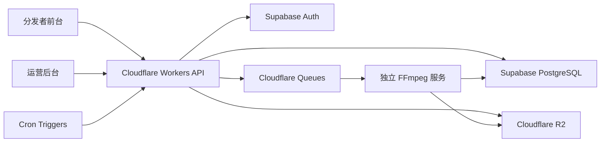

# ClipPartner 切片合伙人项目实施方案

## 1. 项目结论

ClipPartner 的核心定位不是剪辑工具，而是一套面向自有 IP 直播素材的授权分发系统。第一版要优先跑通以下商业闭环：

```
IP 录屏
→ 后台人工切片
→ 素材标注
→ 绑定商品
→ 分发者申请授权
→ 分发者领取素材
→ 发布并挂指定商品链接
→ 回填作品链接
→ 后台记录数据
→ 按比例生成结算台账
```

项目第一阶段不追求自动发布、自动抓单、AI 切片和自动打款，而是先把素材、授权、发布、结算这条运营链路做稳定。

## 2. 对标模式与自有化边界

本项目可直接参考“众小二 / 三只羊”直播切片分发模式，但不是接入第三方切片平台，而是做成平台方自己的系统。核心思路是：平台方掌握 IP、直播录屏、商品链接、授权审核、分发数据和佣金结算，外部分发者只在获得授权后领取素材并发布。

| 对标能力 | 平台方自有系统实现 |
| --- | --- |
| IP / 主播素材供给 | 平台方维护自有 IP 账号，上传直播录屏并生成切片素材 |
| 分发者入驻 | 分发者通过微信登录、手机号绑定、社媒账号绑定进入系统 |
| 授权审核 | 后台按 IP 审核分发者授权，控制素材查看和下载权限 |
| 素材分发 | 已授权分发者领取素材，下载切片视频，复制文案和商品链接 |
| 商品挂载 | 素材绑定平台指定精选联盟商品，分发者发布时必须挂指定链接 |
| 发布追踪 | 分发者回填作品链接，后台审核作品和商品挂载情况 |
| 数据回收 | 第一版人工录入或导入播放、成交、佣金数据，后续接平台接口 |
| 佣金结算 | 平台方根据发布记录、成交数据和分成比例生成结算台账 |
| 风控追责 | 通过授权、领取、下载、水印、违规记录追踪素材使用链路 |

自有化的价值在于把“众小二模式”的运营方法沉淀为平台方可控的系统资产：素材不散落在聊天工具里，授权不依赖人工表格，分发行为可以追踪，结算有据可查，后续还可以逐步接入自动化数据和风控能力。

## 3. 业务目标

| 目标 | 说明 |
| --- | --- |
| 素材资产化 | 将 IP 直播录屏沉淀为可检索、可授权、可领取、可追踪的切片素材 |
| 分发合规化 | 通过微信登录、手机号绑定、社媒账号绑定、IP 授权审核控制分发权限 |
| 发布可追踪 | 每次素材领取、下载、商品选择、发布链接回填都留痕 |
| 结算可核算 | 根据发布记录、成交数据、分成比例生成分发者结算台账 |
| 风控可处理 | 对违规发布、挂错链接、未授权搬运建立记录和处理流程 |

## 4. 第一版范围

### 4.1 必须实现

后台端：

- IP 账号管理。
- 分发者管理。
- 授权申请审核。
- 直播录屏上传。
- 人工切点生成切片任务。
- 素材标题、标签、卖点、推荐文案、剪辑建议管理。
- 商品库管理。
- 素材与商品绑定。
- 素材领取、下载、发布回填记录。
- 成交数据人工录入或表格导入。
- 分发者佣金台账。
- 基础数据看板。
- 违规记录与处理。

前台端：

- 微信登录。
- 手机号绑定。
- 抖音 / 视频号账号绑定。
- 申请 IP 授权。
- 查看授权审核状态。
- 浏览已授权素材。
- 按 IP、日期、商品、标签筛选素材。
- 查看素材详情。
- 领取并下载素材。
- 复制推荐文案和商品链接。
- 回填发布链接。
- 查看自己的发布记录和结算金额。

### 4.2 第一版暂不实现

- 自动拉取直播录屏。
- AI 自动切片。
- 一键自动发布。
- 自动抓取全部播放数据。
- 自动同步精选联盟订单。
- 自动打款。
- 在线考试系统。
- 多级分销。
- 完整财务税务系统。

## 5. 技术方案

| 模块 | 推荐技术 | 说明 |
| --- | --- | --- |
| 前台页面 | Next.js / React | 分发者登录、账号绑定、素材查看、领取、发布回填 |
| 后台页面 | Next.js / React Admin | 运营审核、素材管理、商品管理、结算管理、数据看板 |
| API 服务 | Cloudflare Workers | 处理业务接口、权限校验、数据读写 |
| 数据库 | Supabase PostgreSQL | 存储用户、授权、素材、商品、发布、结算等核心数据 |
| 登录认证 | Supabase Auth + 微信 OAuth | 支持微信登录、用户注册、手机号绑定 |
| 文件存储 | Cloudflare R2 | 存储直播录屏、切片视频、封面图、证据截图 |
| 队列任务 | Cloudflare Queues | 处理切片任务、异步转码、后续数据同步任务 |
| 定时任务 | Cloudflare Cron Triggers | 定时扫描任务、生成数据快照、提醒未回填记录 |
| 视频处理 | 独立 Server / FFmpeg 服务 | 执行真正的视频切片、转码、水印处理 |

第一版建议将视频处理从 API 服务中拆出，避免 Cloudflare Workers 承担重型转码任务。Workers 只负责任务创建、状态查询、权限校验和业务数据写入。

## 6. 系统架构



## 7. 核心模块设计

### 7.1 分发者与账号模块

目标：确认分发者身份，并把分发者和其社媒账号绑定。

关键能力：

- 微信登录。
- 手机号绑定。
- 分发者资料维护。
- 抖音 / 视频号账号登记。
- 分发者状态管理：正常、待审核、暂停、封禁。

关键规则：

- 未绑定手机号不能申请授权。
- 未绑定社媒账号不能领取素材。
- 被封禁分发者不能登录业务功能，也不能进入结算。

### 7.2 IP 授权模块

目标：控制谁可以看到和领取哪个 IP 的素材。

关键能力：

- 分发者提交授权申请。
- 后台查看申请资料。
- 后台通过、拒绝、暂停、取消授权。
- 支持设置授权有效期和分成比例。

授权状态：

| 状态 | 说明 |
| --- | --- |
| pending | 待审核 |
| approved | 已通过 |
| rejected | 已拒绝 |
| paused | 已暂停 |
| banned | 已封禁 |
| expired | 已过期 |

### 7.3 素材生产模块

目标：将直播录屏变成可领取的切片素材。

关键流程：

```
上传直播录屏
→ 填写来源 IP、平台、日期
→ 后台人工填写切点
→ 创建切片任务
→ FFmpeg 服务生成切片
→ 上传切片和封面
→ 后台补充标题、标签、卖点、文案
→ 绑定商品
→ 上架为可领取
```

素材状态：

| 状态 | 说明 |
| --- | --- |
| draft | 草稿 |
| processing | 切片处理中 |
| ready | 已生成，待完善 |
| published | 可领取 |
| archived | 已下架 |

### 7.4 商品库模块

目标：保证分发者发布时挂载平台指定商品链接。

关键能力：

- 商品信息维护。
- 商品平台、链接、佣金比例维护。
- 商品与素材多对多绑定。
- 商品启用 / 停用。

### 7.5 素材领取与下载模块

目标：每次素材出库都形成可追踪记录。

关键规则：

- 分发者只能领取已授权 IP 的可领取素材。
- 领取时必须选择计划发布平台、社媒账号和推广商品。
- 每次领取生成独立领取记录。
- 下载记录需绑定领取记录、素材、商品、分发者和授权账号。

### 7.6 发布回填模块

目标：让运营能追踪素材最终发布结果。

关键能力：

- 分发者回填作品链接。
- 后台审核链接是否有效。
- 后台记录是否挂指定商品。
- 支持录入播放量、互动数、成交金额、佣金。

发布状态：

| 状态 | 说明 |
| --- | --- |
| claimed | 已领取 |
| downloaded | 已下载 |
| submitted | 已回填链接 |
| verified | 已审核通过 |
| invalid | 链接无效或不合规 |
| settled | 已进入结算 |

### 7.7 佣金结算模块

目标：形成清晰的分发者收益台账。

第一版结算逻辑：

```
可结算金额 = 有效成交佣金 × 分发者分成比例
```

不进入结算的情况：

- 发布链接未回填。
- 后台审核未通过。
- 未挂指定商品链接。
- 作品违规。
- 订单售后或退款。
- 低于最低结算金额。

### 7.8 风控模块

目标：降低素材外泄、违规发布和挂错商品链接造成的损失。

第一版重点：

- 下载前必须授权。
- 素材领取和下载全量留痕。
- 下载版视频增加可见授权水印。
- 后台记录违规线索。
- 违规作品不结算。
- 多次违规可暂停或取消授权。

## 8. 数据对象

第一版建议至少建立以下数据表：

| 数据对象 | 说明 |
| --- | --- |
| users | 用户基础身份 |
| distributor_profiles | 分发者资料 |
| social_accounts | 分发者绑定的抖音 / 视频号账号 |
| ip_accounts | 平台自有 IP 账号 |
| authorization_requests | IP 授权申请 |
| authorizations | 授权关系 |
| live_recordings | 直播录屏 |
| clip_assets | 切片素材 |
| products | 商品库 |
| clip_products | 素材与商品关联 |
| clip_claims | 素材领取记录 |
| clip_downloads | 素材下载记录 |
| publish_records | 发布回填记录 |
| performance_snapshots | 播放、互动、成交数据快照 |
| commission_records | 佣金明细 |
| settlement_orders | 结算单 |
| violation_records | 违规记录 |
| violation_leads | 未授权搬运线索 |

## 9. 关键接口

前台接口：

- `POST /auth/wechat/login`：微信登录。
- `POST /profile/phone/bind`：绑定手机号。
- `POST /social-accounts`：绑定社媒账号。
- `POST /authorization-requests`：申请 IP 授权。
- `GET /materials`：查询授权素材。
- `GET /materials/:id`：查看素材详情。
- `POST /materials/:id/claim`：领取素材。
- `POST /claims/:id/download-url`：获取下载链接。
- `POST /publish-records`：回填发布链接。
- `GET /settlements/me`：查看个人结算记录。

后台接口：

- `GET /admin/authorization-requests`：授权申请列表。
- `POST /admin/authorization-requests/:id/approve`：通过授权。
- `POST /admin/authorization-requests/:id/reject`：拒绝授权。
- `POST /admin/live-recordings`：上传录屏记录。
- `POST /admin/clip-tasks`：创建切片任务。
- `GET /admin/clip-assets`：素材列表。
- `POST /admin/products`：创建商品。
- `POST /admin/clip-assets/:id/products`：绑定商品。
- `GET /admin/publish-records`：发布记录管理。
- `POST /admin/performance/import`：导入成交或表现数据。
- `POST /admin/settlements/generate`：生成结算单。
- `POST /admin/violations`：创建违规记录。

## 10. 项目阶段规划

### 第 0 阶段：准备期

目标：完成可开发输入。

交付物：

- 产品原型。
- 数据库 ERD。
- 权限矩阵。
- API 清单。
- 文件存储路径规范。
- 视频处理任务状态规范。

### 第 1 阶段：MVP 闭环

目标：跑通授权、素材、商品、发布、结算主流程。

建议周期：3～5 周。

交付物：

- 分发者前台。
- 运营后台。
- 用户与权限体系。
- 素材上传、人工切点、切片任务。
- 商品库。
- 素材领取和下载。
- 发布链接回填。
- 佣金台账。
- 基础看板。

验收标准：

- 分发者可以完成注册、绑定、授权申请。
- 后台可以审核授权并开放素材权限。
- 后台可以上传录屏并生成切片素材。
- 分发者只能查看和领取已授权 IP 的素材。
- 每次领取、下载、发布回填都有记录。
- 后台可以根据成交数据生成结算金额。

### 第 2 阶段：运营效率提升

目标：减少人工统计和重复操作。

交付物：

- 成交数据批量导入优化。
- 发布数据批量导入。
- 数据快照。
- 待回填、待审核、待结算提醒。
- 分发者排行榜、素材效果排行、商品效果排行。

### 第 3 阶段：自动化与风控增强

目标：提升素材生产效率和风控能力。

交付物：

- 视频隐形水印或指纹。
- 未授权搬运线索管理增强。
- 平台数据接口接入。
- 半自动素材推荐。
- AI 标题、标签、文案辅助。

### 第 4 阶段：结算自动化

目标：提升财务效率。

交付物：

- 结算审核流。
- 分发者收益明细。
- 财务报表。
- 打款记录。
- 自动打款接口。

## 11. 主要风险与处理建议

| 风险 | 影响 | 建议 |
| --- | --- | --- |
| 平台接口接入不确定 | 自动发布、自动抓数延期 | 第一版保留手动发布和人工导入兜底 |
| 素材外泄 | IP 内容被盗用 | 下载授权、水印、领取留痕、违规不结算 |
| 分发者挂错商品 | 佣金归属不清 | 领取时强制选择商品，回填后后台审核 |
| 视频处理耗时 | 素材上架效率下降 | 切片服务异步处理，后台展示任务状态 |
| 结算争议 | 影响分发者信任 | 保留领取、发布、成交、审核、结算全链路记录 |
| 需求膨胀 | MVP 延迟 | AI、自动发布、自动打款全部放到后续阶段 |

## 12. 近期执行清单

1. 确认第一版只覆盖抖音、视频号，还是先只做一个平台。
2. 确认微信登录主体、OAuth 配置和手机号绑定方式。
3. 确认精选联盟商品链接的录入和佣金数据来源。
4. 确认直播录屏上传大小、格式和平均时长。
5. 确认切片服务部署位置和 FFmpeg 处理规格。
6. 输出后台和前台原型。
7. 输出数据库表结构和 RLS 权限规则。
8. 搭建 Next.js、Workers、Supabase、R2 基础项目。
9. 先实现授权申请、素材管理、领取下载、发布回填四个主流程。
10. 再补充结算台账、数据看板和违规记录。
